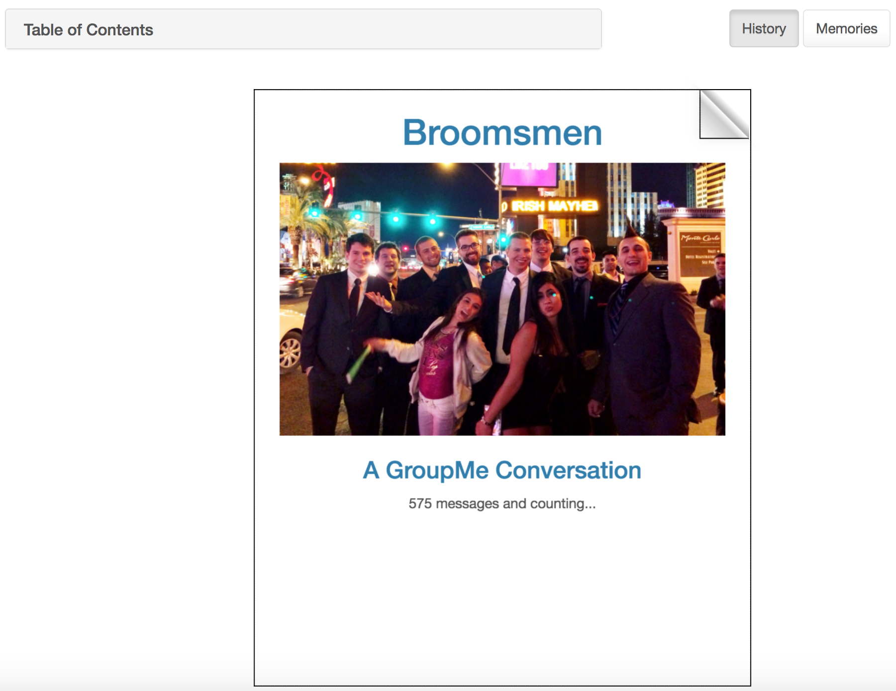
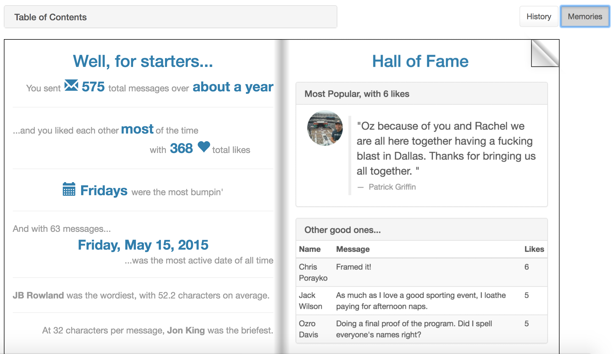

#GroupMe Memories

Retrieve entire conversation histories from [GroupMe](https://web.groupme.com/) to create customizable eBooks. Traverse your conversation page by page, and click on individual messages to save them in a separate, shareable Memories eBook, complete with statistics, popular messages, and personal highlights.

##Screenshots



##Features
* Traverse entire conversation histories by flipping the pages of an eBook
* Navigate your conversation by date using the Table of Contents
* Download the transcript as a CSV file
* Save your personalized eBooks for easy retrieval
* View statistics, popular messages, and calculated superlatives in the Memories eBook
* Click on any message in the Memories eBook to flip back to its context in the Histories eBook
* Click on any message in the Histories eBook to add it to the "Memorable Quotes" section of the Memories ebook
* Create a shareable link for both eBooks that doesn't require a login

##Technologies
* [GroupMe API](https://dev.groupme.com/docs/v3)
* [TurnJS](http://www.turnjs.com/)
* [AngularJS 1](https://angularjs.org/)
* [JQuery](https://jquery.com/)
* [Bootstrap](https://getbootstrap.com/)

##Development
Clone this repo and from the `public` directory:
```
cd lib
bower install
npm install
```

Create an `fbKeys.js` file in the `public/js/factories` directory with the following content:

```
"use strict";

app.constant('fbKeys',{
  apiKey: "<YOUR FIREBASE API KEY>",
  authDomain: "<YOUR FIREBASE AUTH DOMAIN>",
  databaseURL: "<YOUR FIREBASE DATABASE URL>",
  storageBucket: "<YOUR FIREBASE STORAGE BUCKET>"
});
```
